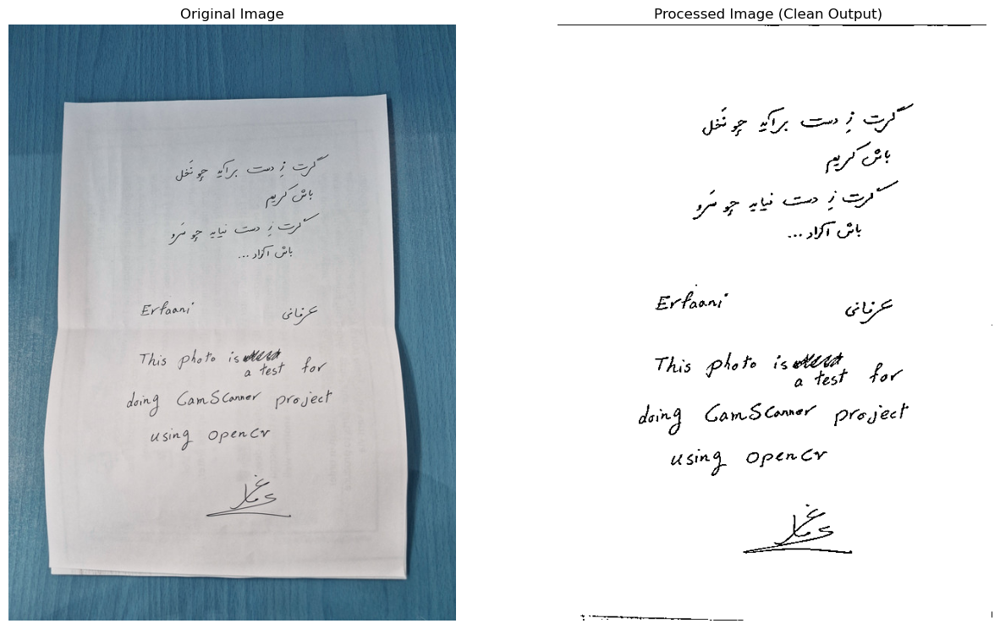

# CamScanner Project

## Introduction
The CamScanner project is a Python-based tool designed for uploading, processing, and optimizing images. It allows users to extract and enhance scanned-like images, such as notes or documents, by identifying edges and applying transformations.

### Features
- **Image Upload:** Easily upload images in `.jpg` or `.png` formats.
- **Edge Detection:** Automatically detects the edges of a document or note.
- **Image Optimization:** Removes noise, converts images to grayscale, and adjusts perspective for a clean look.
- **Display Results:** Shows both the original and processed images side by side for comparison.

## Technologies Used
- **Python**: The backbone of this project.
- **OpenCV**: Handles image processing tasks like edge detection and transformations.
- **Pillow (PIL)**: Manages image formats and manipulations.
- **Matplotlib**: Visualizes uploaded and processed images.
- **Ipywidgets**: Provides an interactive user interface.
- **Jupyter Notebook**: Facilitates running and testing the code.

## Installation
To get started with this project, follow these steps:

1. Clone the repository:
   
   git clone https://github.com/Erfaani/cam-scanner.git
   

2. Install the required dependencies:
   
   pip install opencv-python pillow matplotlib ipywidgets
   

3. Run the Jupyter Notebook:
   
   jupyter notebook
   

4. Open the notebook file and execute the cells to see the project in action.

## How It Works
1. **Upload an Image:** Use the upload widget to select a `.jpg` or `.png` file from your system.
2. **Process the Image:** Click on the "Process Image" button to start the magic.
3. **View Results:** Instantly view the uploaded image and its enhanced version side by side.

## Usage Example
1. Upload an image of a notebook or document.
2. The tool detects the edges and removes unnecessary noise.
3. The result is a clean, perspective-adjusted image ready for use.

## Limitations
- This tool performs best with clear images and uniform lighting.
- It may struggle with highly noisy images or unclear document edges.

## Future Improvements
- **OCR Integration:** Add text extraction capabilities for scanned documents.
- **PDF Support:** Enable processing of multi-page PDF files.
- **Customizable Parameters:** Allow users to tweak thresholds and filters as needed.
- **Save Processed Images:** Provide a feature to download enhanced images directly.

## Contributing
We welcome contributions! Feel free to fork this repository and submit a pull request. If you have a major idea, please open an issue to discuss it with us first.

## License
This project is licensed under the MIT License - see the LICENSE file for details.

## Acknowledgments
Special thanks to:
- The **OpenCV** and **Pillow** communities for their fantastic libraries.
- Everyone who tested and provided feedback to improve this tool.

## Example Results
### Output Example
Here’s an example of the processed output image:

The output image is saved in the `Image` folder of the project directory.

---

If you have any questions or suggestions, feel free to reach out:
- Email: ErfanJouybar@Gmail.com
- GitHub: [Erfaani](https://github.com/Erfaani)
- LinkedIn: (https://www.linkedin.com/in/erfanjouybar)